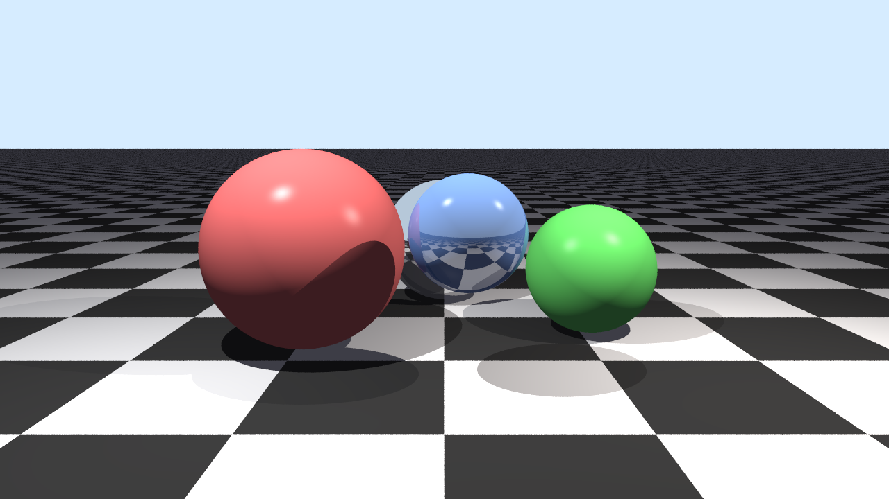

# Raytracer Engine
A simple demonstration of raytracing technique leveraging multithreading in C++

## `/src`
Holds header files of all scene elements and the scene itself

## Build
```
cd raytracer
cmake -S . -B build -DCMAKE_BUILD_TYPE=Release
cmake --build build -j

./build/raytracer <width> <height> <spp> <cores> # Set cores to 0 to auto detect
```

### Optionally: Convert .ppm to .png
```
magick convert out.ppm out.png
```

## Output

